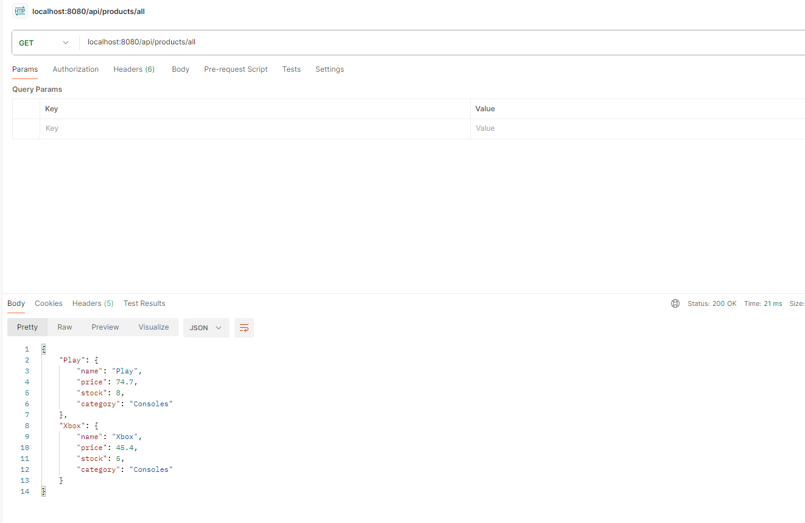
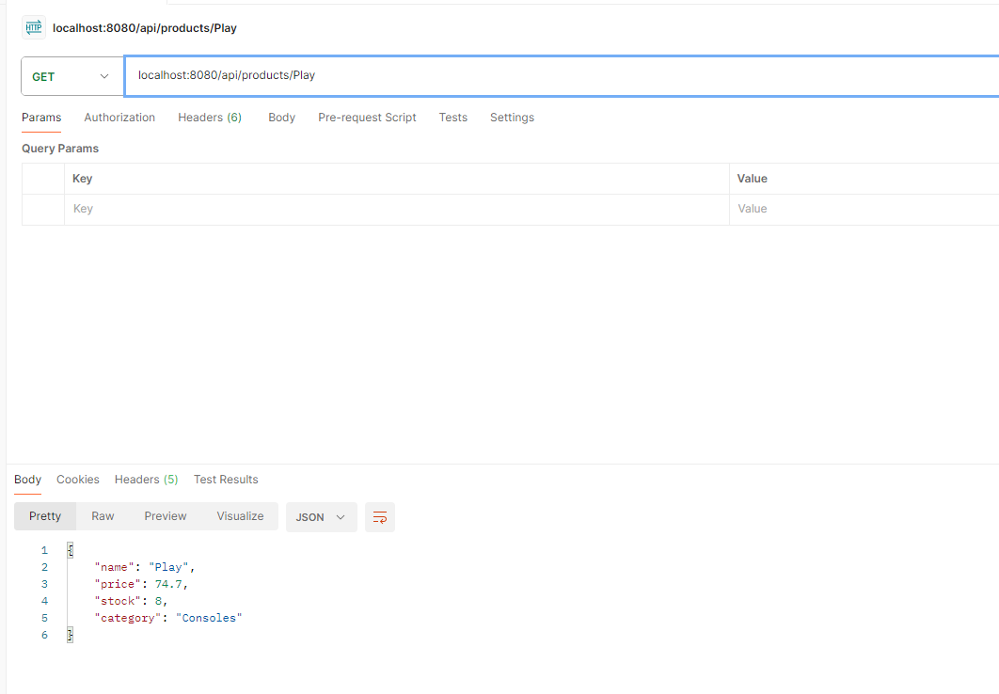
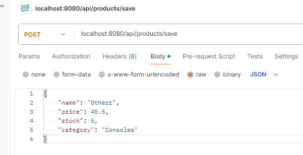
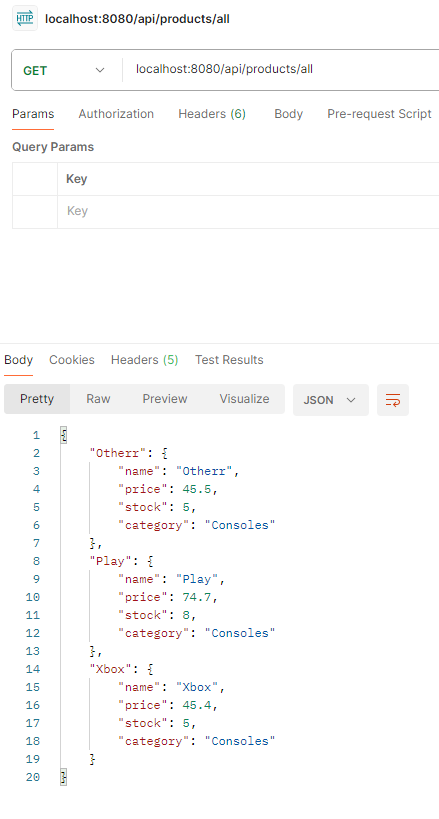
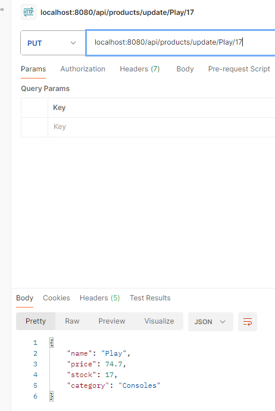
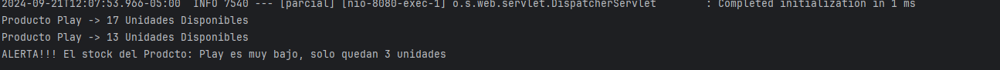

# Parcial CVDS 2024-2

## Diego Alexander Cardenas Beltran

## Implementaciones
- Spring Boot
- Maven

## Diegrama de clases

## Provando metodos en PostMan

### /products/all

### /products/Play

### /products/save

### /product/update/{name}/{stock}

Se hace las respentibas pruebas de los dos agentes y se usan los metodos de
/product/update/{name}/{stock} para conprobar que todo este corriendo correctamente 
